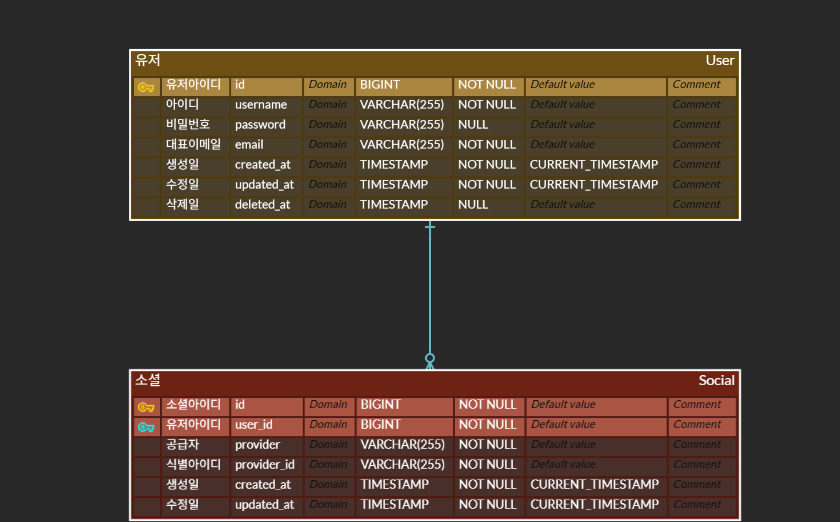

# 🔐 통합 로그인 시스템 설계

일반 계정(이메일/비밀번호)과 소셜 계정(Google, Naver, Kakao, GitHub)을 통합하는 인증 시스템 설계 문서입니다.

---
## ERD


---

## 📌 기본 원칙

- **이메일 주소**를 기준으로 유저 단위를 구분한다.
- 소셜 로그인은 `provider` + `provider_id` 조합으로 계정을 식별한다.
- 소셜 계정의 이메일이 변경되더라도 `provider_id` 기준으로 로그인한다.

---

## 📋 소셜 로그인 제공자

| Provider | 비고 |
|----------|------|
| Google   | |
| Naver    | |
| Kakao    | |
| GitHub   | |

> 향후 제공자를 줄일 수는 있으나 늘리지는 않는다.

---

## 🚀 회원가입 플로우

### 등록되지 않은 이메일로 가입 시

#### 일반 가입
```
이메일 입력
  → 이메일 인증 메일 발송
  → 인증 완료
  → 아이디 + 비밀번호 입력
  → 가입 완료
```

#### 소셜 가입
```
소셜 OAuth 인증
  → 아이디 입력 (임시 데이터는 Redis에 TTL 설정하여 저장)
  → 가입 완료 (대표 이메일 = 소셜 이메일)
```

---

### 이미 등록된 이메일로 가입 시

#### 일반 가입 시도
```
이메일 입력
  → 이미 등록된 이메일 감지
  → 가입 차단
  → "해당 이메일에 연동된 소셜 계정으로 로그인 후 비밀번호를 설정하세요" 안내
```

#### 소셜 가입 시도
```
소셜 OAuth 인증
  → 이미 등록된 이메일 감지
  → "기존 계정과 연동하시겠습니까?" 안내
    ├── 연동 선택 → 기존 계정에 소셜 연동 추가
    └── 연동 거부 → Redis 임시 데이터 즉시 삭제 후 가입 차단
```

---

## 🔗 소셜 계정 연동

### 임시 데이터 관리 (Redis)

소셜 OAuth 인증 후 아이디 입력, 연동 여부 확인 등 추가 절차가 필요한 경우 `provider`와 `provider_id`를 Redis에 임시 저장한다.

```
저장 시점  : OAuth 콜백 직후
TTL       : 단기 설정 (사용자가 응답하지 않으면 자동 만료)
삭제 시점  : 가입/연동 완료 시 또는 연동 거부 선택 시 즉시 삭제
```

### 연동 해제 조건

아래 조건 중 하나 이상을 만족해야 연동 해제가 가능하다. 마지막 로그인 수단을 제거하여 고아 계정이 되는 것을 방지한다.

```
비밀번호가 설정되어 있거나
  OR
다른 소셜 계정이 1개 이상 연동되어 있거나
```

---

## 🔑 비밀번호 설정

소셜 계정으로만 가입한 유저가 비밀번호를 설정하거나 변경할 때는 반드시 이메일 인증을 거친다.

```
비밀번호 설정 요청
  → 대표 이메일로 인증 메일 발송
  → 인증 완료
  → 비밀번호 설정
```

---

## 🗑️ 계정 탈퇴 및 마스킹

탈퇴 시 동일 이메일로 재가입이 가능하도록 개인 식별 정보를 마스킹 처리한다.

| 항목 | 처리 방식 |
|------|-----------|
| `User.email` | `deleted_[난수]_[원본이메일]` 형식으로 마스킹 |
| `Social.provider_id` | `deleted_[난수]_[원본ID]` 형식으로 마스킹 |

---

## ⚠️ 소셜 이메일 변경 시나리오

소셜 서비스에서 이메일을 변경해도 우리 서비스는 `provider_id` 기준으로 로그인한다.
이로 인해 아래와 같은 상황이 발생할 수 있다.

```
시나리오
  1. a@gmail.com 으로 소셜 가입
  2. 소셜 서비스에서 이메일을 b@gmail.com 으로 변경
  3. b@gmail.com 으로 일반 가입
  4. 소셜 로그인 시 → a@gmail.com 계정으로 로그인됨 (provider_id 기준)

b@gmail.com 계정과 소셜을 연동하려면?
  → a@gmail.com 계정에서 해당 소셜 연동 해제
  → 소셜 재로그인 시 b@gmail.com 계정에 연동됨
```

### 고아 계정 방지

위 시나리오에서 `a@gmail.com` 계정은 소셜 연동 해제 후 접근 수단이 없어질 수 있다.
이를 방지하기 위해 연동 해제 전 아래 중 하나를 먼저 진행해야 한다.

```
Option 1. 새로운 대표 이메일 설정 후 비밀번호 설정
Option 2. 다른 소셜 계정 추가 연동
```

---

## 💀 해결 불가능한 케이스

소셜 계정으로만 가입한 후, 해당 소셜 서비스에서 탈퇴하면 로그인 수단이 없어진다.
본 서비스에는 휴대폰 인증 등 대체 본인 확인 수단이 없으므로 **계정을 복구할 방법이 없다.**

> 이는 사용자 부주의로 인한 문제이며, 서비스 차원의 해결책은 없다.
> 소셜 탈퇴 전 반드시 비밀번호를 설정하거나 다른 소셜 계정을 연동해둘 것을 권장한다.